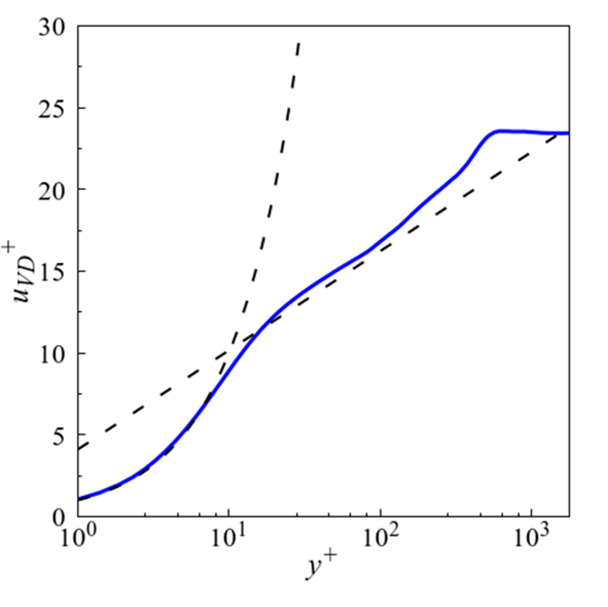
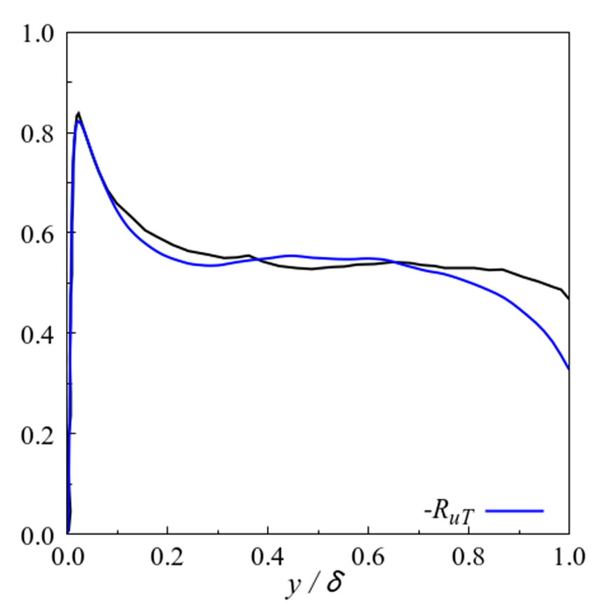
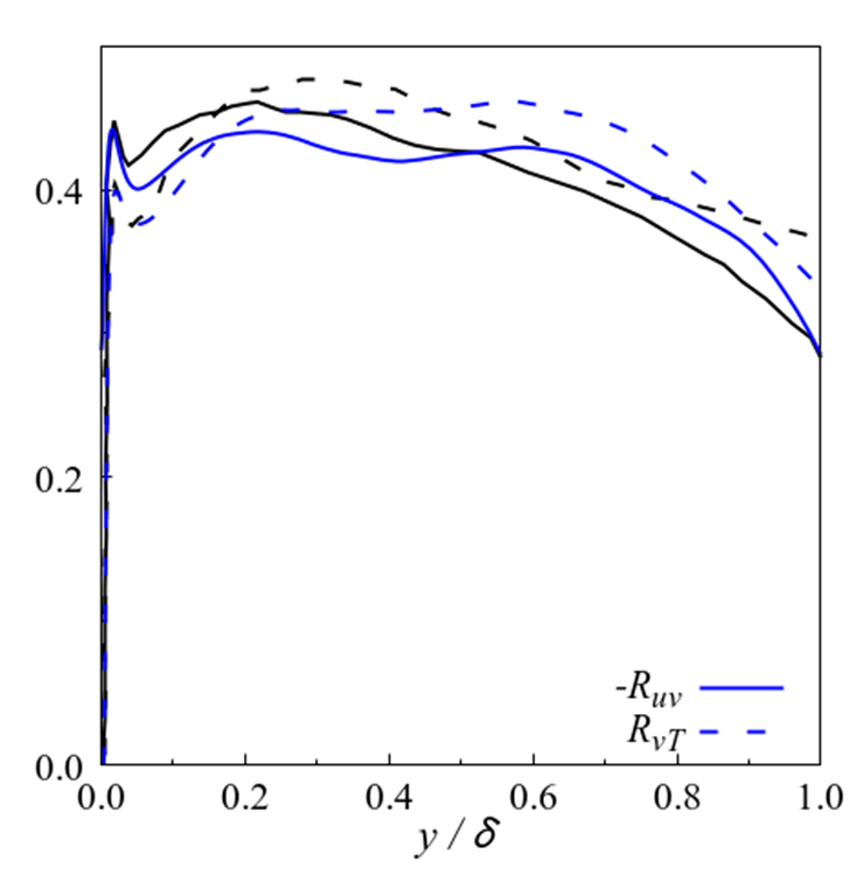
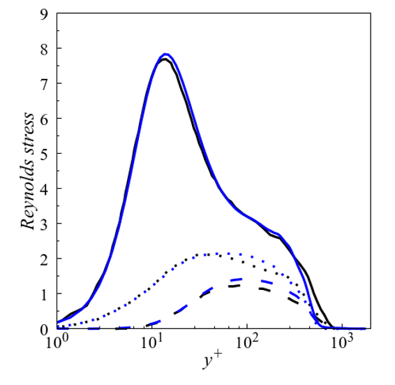
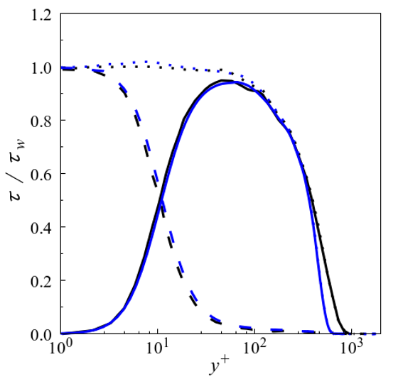
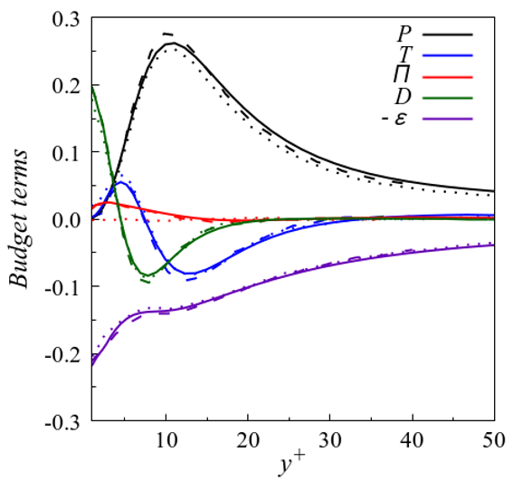

<!DOCTYPE html>
<html lang="en">
<head>
  <meta charset="UTF-8">
  <link rel="stylesheet" href="css/style.css">
</head>

<body>
  <header>
    <h1 id="title">
      GPU Based Explicit solver
    </h1>
    <nav id="nav_section">
      <ul>
        <li><a href="#numerical_method">Numerical Method</a></li>
        <li><a href="#dependencies">Dependencies</a></li>
        <li><a href="#validation_verification">Validation and Verification</a></li>
      </ul>
    </nav>
  </header>

  <main>
    <section id="numerical_method">
      <h2 class="main_section">
        Numerical method
      </h2>
        <h3>
          Convective term
        </h3>
        <h3>
          Viscous term
        </h3>
    </section>
    <section id="dependencies">
      <h2 class="main_section">
        Dependencies
      </h2>
    </seciton>
    <section id="validation_verification">
      <h2 class="main_section">
        Validation and Verification
      </h2>
      <nav id="nav_problem">
        <h3>Test problems</h3>
        <ul>
          <li><a href="#EVC">Euler vortex convection</a></li>
          <li><a href="#ST">Sod shock tube</a></li>
          <li><a href="#SO">Shu-Osher problm</a></li>
          <li><a href="#DSL">Inviscid 2D double shear layer</a></li>
          <li><a href="#KHI">Inviscid 3D Kelvin-Helmholtz instability</a></li>
          <li><a href="#VTGV">3D viscous Taylor-Green vortex</a></li>
          <li><a href="#TBL">M=1.9 supersonic turbulent boundary layer</a></li>
        </ul>
      </nav>
      <section>
        <h2>Euler equation</h2>
          <ul id="problems">
            <li id="EVC">Euler vortex convection</li>
              <ul>
                <li>Computational grid</li>
                <li>Flow condition</li>
                <li>Result</li>
                  <ul>
                    <li>Visualization</li>
                    <li>Grid convergence</li>
                  </ul>
              </ul>
            <li id="ST">Sod shock tube</li>
              <ul>
                <li>Computational grid</li>
                <li>Flow condition</li>
                <li>Result</li>
                  <ul>
                    <li>Visualization</li>
                  </ul>
              </ul>
            <li id="SO">Shu-Osher problem</li>
              <ul>
                <li>Computational grid</li>
                <li>Flow condition</li>
                <li>Result</li>
                  <ul>
                    <li>Visualization</li>
                  </ul>
              </ul>
            <li id="DSL">Inviscid 2D double shear layer</li>
              <ul>
                <li>Computational grid</li>
                <li>Flow condition</li>
                <li>Result</li>
                  <ul>
                    <li>Visualization</li>
                    <li>Detailed velocity profile</li>
                  </ul>
              </ul>
            <li id="KHI">Inviscid 3D Kelvin-Helmholtz instability</li>
              <ul>
                <li>Computational grid</li>
                <li>Flow condition</li>
                <li>Result</li>
                  <ul>
                    <li>Visualization</li>
                  </ul>
              </ul>
          </ul>
        <h2>Navier-Stokes equation</h2>
          <ul id="problems">
            <li id="VTGV">3D viscous Taylor-Green vortex</li>
              <ul>
                <li>Computational grid</li>
                <li>Flow condition</li>
                <li>Result</li>
                  <ul>
                    <li>Visualization</li>
                    <li>Evolution of kinetic energy and enstrophy</li>
                  </ul>
              </ul>
            <li id="TBL">M=1.9 supersonic turbulent boundary layer</li>
              <ul>
                <li>Computational grid</li>
                <li>Flow condition</li>
                <li>Result</li>
                  <ul>
                    <li>Visualization</li>
                    <li>Turbulent statistics</li>
                      <ul>
                        <li>Log-law</li>
                          

                            
                            
Fig

                          

                        <li>Thermal properties</li>
                          <ul>
                            <li>RMS</li>
                              

                                
                                
Fig

                              

                              

                                
                                
Fig

                              

                            <li>Strong Reynolds analogy</li>
                              

                                
                                
Fig

                              

                              

                                
                                
Fig

                              

                          </ul>
                        <li>Reynolds stress</li>
                          

                            
                            
Fig

                          

                          

                            
                            
Fig

                          

                        <li>TKE budget</li>
                          

                            
                            
Fig

                          

                      </ul>
                  </ul>
              </ul>
          </ul>
      </section>
    </section>
  </main>

  <h2>
  Reference
  </h2>
  <ul>
  <li><a href="https://www.sciencedirect.com/science/article/abs/pii/S0021999118305916">
  Yuichi Kuya, Kosuke Totani, Soshi Kawai, Kinetic energy and entropy preserving schemes for compressible flows by split convective forms, Journal of Computational Physics, 2018</a>
  </li>
  <li><a href="https://www.sciencedirect.com/science/article/abs/pii/S0021999121003776">
  Yuichi Kuya, Soshi Kawai, High-order accurate kinetic-enrgy and entropy preserving (KEEP) schemes on curvilinear grids, Journal of Computational Physics, 2021</a>
  </li>
  <li><a href="https://www.sciencedirect.com/science/article/pii/S187775031630299X?via%3Dihub">
  Christian T. Jacobs, Satya P. Jammy, Neil D. Sandham, OpenSBLI: A framework for the automated derivation and parallel execution of finite difference solvers on a range of computer architectures, 2017</a>
  </li>
  <li><a href="https://arc.aiaa.org/doi/abs/10.2514/6.2009-3797">
  Yves Allaneau, Antony Jameson, Direct Numerical Simulations of a Two-Dimensional Viscous Flow in a Shocktube Using Kinetic Energy Preserving Scheme, 2012</a>
  </li>
  <li><a href="https://arc.aiaa.org/doi/10.2514/6.2023-0429">Yoshiharu Tamaki, Soshi Kawai, Wall-modeled LES of transonic buffet over NASA-CRM using Cartesian-grid-based flow solver FFVHC-ACE, 2023</a>
  </li>
  <li><a href="https://docs.nvidia.com/hpc-sdk/pgi-compilers/2017/pgi17cudaforug.pdf">
  CUDA FORTRAN PROGRAMMING GUIDE AND REFERENCE, 2017</a>
  </li>
  </ul>

  <footer>
  </footer>
</body>
</html>
