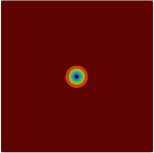
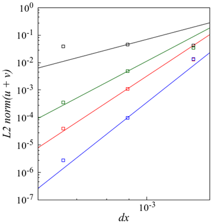
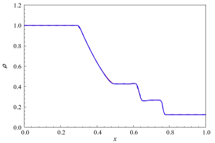
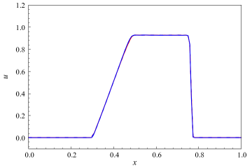
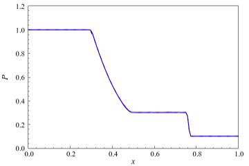
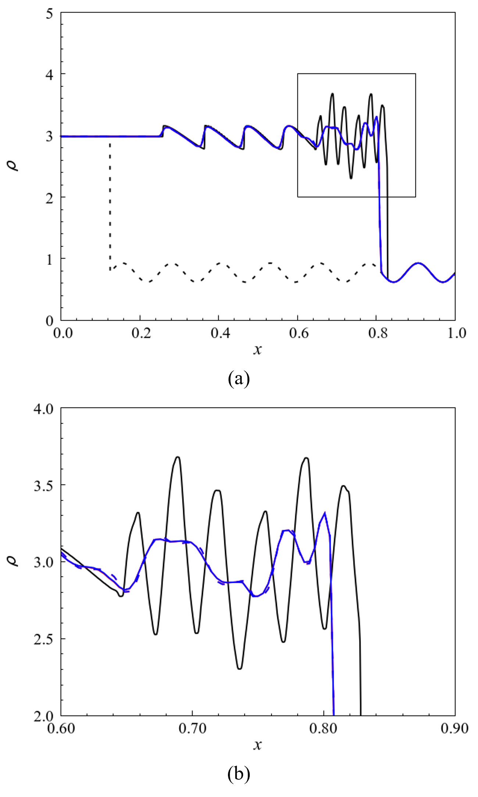
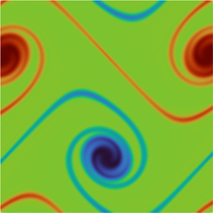
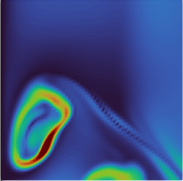
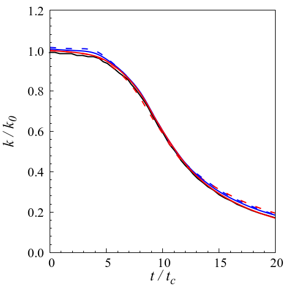
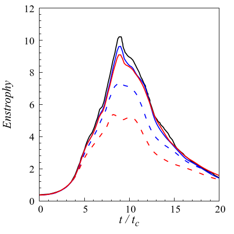

<!DOCTYPE html>
<html lang="en">
<head>
  <meta charset="UTF-8">
  <link rel="stylesheet" href="css/style.css">
</head>

<body>
  <header>
    <h1>
      GPU Based Explicit solver
    </h1>
    <nav id="nav_section">
      <ul>
        <li><a href="#numerical_method">Numerical Method</a></li>
        <li><a href="#dependencies">Dependencies</a></li>
        <li><a href="#validation_verification">Validation and Verification</a></li>
        <li><a href="#Reference">Reference</a></li>
      </ul>
    </nav>
  </header>

  <main>
    <section id="numerical_method">
      <h2>
        Numerical method
      </h2>
        <h3>
          Convective term
        </h3>
        <h3>
          Viscous term
        </h3>
    </section>
    <section id="dependencies">
      <h2>
        Dependencies
      </h2>
    </seciton>
    <section id="validation_verification">
      <h2>
        Validation and Verification
      </h2>
      <nav id="nav_problem">
        <h3>Test problems</h3>
        <ol>
          
Euler equation

          <li><a href="#EVC">Euler vortex convection</a></li>
          <li><a href="#ST">Sod shock tube</a></li>
          <li><a href="#SO">Shu-Osher problm</a></li>
          <li><a href="#DSL">Inviscid 2D double shear layer</a></li>
          <li><a href="#KHI">Inviscid 3D Kelvin-Helmholtz instability</a></li>
          
Navier-Stokes equation

          <li><a href="#VTGV">3D viscous Taylor-Green vortex</a></li>
          <li><a href="#TBL">M=1.9 supersonic turbulent boundary layer</a></li>
        </ol>
      </nav>
      <section>
        <ol>
          <li id="EVC">Euler vortex convection</li>
            <ul>
              <li>Computational grid</li>
                <table>
                  <thead>
                    <tr>
                      <th scope="col">Computational domain [Lx, Ly]</th>
                      <th scope="col">Grid points [Nx, Ny]</th>
                    </tr>
                  </thead>
                  <tbody>
                    <tr>
                      <td>0.1, 0.1</td>
                      <td>[64, 64], [128, 128], [256, 256]</td>
                    </tr>
                  </tbody>
                </table>
              <li>Flow condition</li>
              <li>Result</li>
                <ul>
                  <li>Visualization</li>
                    <figure>
                      
                      <figcaption>Instantaneous density field at 50 period</figcaption>
                    </figure>
                  <li>Grid convergence</li>
                    <figure>
                      
                      <figcaption>Error between numerical solution and theoretical solution at 50 period; solid line for theoretical rate, black square points for 2nd-order KEEP, green square points for 4th-order KEEP, red square points for 5th-order HR-SLAU2 and blue square points for 6th-KEEP</figcaption>
                    </figure>
                </ul>
              </ul>
          <li id="ST">Sod shock tube</li>
            <ul>
              <li>Computational grid</li>
                <table>
                  <thead>
                    <tr>
                      <th scope="col">Computational domain [Lx]</th>
                      <th scope="col">Grid points [Nx]</th>
                    </tr>
                  </thead>
                  <tbody>
                    <tr>
                      <td>1</td>
                      <td>[128]</td>
                    </tr>
                  </tbody>
                </table>
              <li>Flow condition</li>
              <li>Result</li>
                <ul>
                  <li>Visualization</li>
                    <figure>
                      
                      <figcaption>Instantaneous density field at t=0.2; red solid line for 3rd-order SLAU, red dashed line for 4th-order SLAU, blue solid line for 3rd-order HR-SLAU2 and blue dashed line for 4th-order HR-SLAU2</figcaption>
                    </figure>
                    <figure>
                      
                      <figcaption>Instantaneous velocity field at t=0.2; red solid line for 3rd-order SLAU, red dashed line for 4th-order SLAU, blue solid line for 3rd-order HR-SLAU2 and blue dashed line for 4th-order HR-SLAU2</figcaption>
                    </figure>
                    <figure>
                      
                      <figcaption>Instantaneous pressure field at t=0.2; red solid line for 3rd-order SLAU, red dashed line for 4th-order SLAU, blue solid line for 3rd-order HR-SLAU2 and blue dashed line for 4th-order HR-SLAU2</figcaption>
                    </figure>
                </ul>
            </ul>
          <li id="SO">Shu-Osher problem</li>
            <ul>
              <li>Computational grid</li>
                <table>
                  <thead>
                    <tr>
                      <th scope="col">Computational domain [Lx]</th>
                      <th scope="col">Grid points [Nx]</th>
                    </tr>
                  </thead>
                  <tbody>
                    <tr>
                      <td>1</td>
                      <td>[256], [2048]</td>
                    </tr>
                  </tbody>
                </table>
              <li>Flow condition</li>
              <li>Result</li>
                <ul>
                  <li>Visualization</li>
                    <figure>
                      
                      <figcaption>Instantaneous density field at t=0.2 (a) whole computational domain, (b) from x=0.6 to x=0.9; red solid line for 3rd-order SLAU, red dashed line for 4th-order SLAU, blue solid line for 3rd-order HR-SLAU2, blue dashed line for 4th-order HR-SLAU2, black solid line for 4th-order HR-SLAU2 with very fine grid and black dashed line for initial condition</figcaption>
                    </figure>
                </ul>
            </ul>
          <li id="DSL">Inviscid 2D double shear layer</li>
            <ul>
              <li>Computational grid</li>
                <table>
                  <thead>
                    <tr>
                      <th scope="col">Computational domain [Lx, Ly]</th>
                      <th scope="col">Grid points [Nx, Ny]</th>
                    </tr>
                  </thead>
                  <tbody>
                    <tr>
                      <td>2&pi; , 2&pi;</td>
                      <td>[128, 128]</td>
                    </tr>
                  </tbody>
                </table>
              <li>Flow condition</li>
              <li>Result</li>
                <ul>
                  <li>Visualization</li>
                    <figure>
                      
                      <figcaption>Instantaneous vorticity field at non-dimensional time t=8 of M=0.1</figcaption>
                    </figure>
                </ul>
            </ul>
          <li id="KHI">Inviscid 3D Kelvin-Helmholtz instability</li>
            <ul>
              <li>Computational grid</li>
                <table>
                  <thead>
                    <tr>
                      <th scope="col">Computational domain [Lx, Ly, Lz]</th>
                      <th scope="col">Grid points [Nx, Ny, Nz]</th>
                    </tr>
                  </thead>
                  <tbody>
                    <tr>
                      <td>[-0.5, 0.5], [-0.5, 0.5], [-0.5, 0.5]</td>
                      <td>[256, 256, 256]</td>
                    </tr>
                  </tbody>
                </table>
              <li>Flow condition</li>
              <li>Result</li>
                <ul>
                  <li>Visualization</li>
                </ul>
            </ul>
          <li id="VTGV">3D viscous Taylor-Green vortex</li>
            <ul>
              <li>Computational grid</li>
                <table>
                  <thead>
                    <tr>
                      <th scope="col">Computational domain [Lx, Ly, Lz] (mm)</th>
                      <th scope="col">Grid points [Nx, Ny, Nz]</th>
                    </tr>
                  </thead>
                  <tbody>
                    <tr>
                      <td>2&pi;L, 2&pi;L , 2&pi;L</td>
                      <td>[128, 128, 128], [256, 256, 256]</td>
                    </tr>
                  </tbody>
                </table>
              <li>Flow condition</li>
              <li>Result</li>
                <ul>
                  <li>Visualization</li>
                    <figure>
                      
                      <figcaption>Contours of the vortisity norm at non-dimensional time t=8 on the plane x=0, in the region y=&pi;L to 3&pi;L/2 and z=&pi;L/2 to &pi;L</figcaption>
                    </figure>
                  <li>Evolution of kinetic energy and enstrophy</li>
                    <figure>
                      
                      <figcaption>Time evolution of the total kinetic energy as a function of the dimensionless time; red solid line for 5th-order HR-SLAU2 with grid points [256, 256, 256], red dashed line for 5th-order HR-SLAU2 with grid points [128, 128, 128], blue solid line for 6th-order KEEP with grid points [256, 256, 256], blue dashed line for 6th-order KEEP with grid points [128, 128, 128] and black solid line for Reference</figcaption>
                    </figure>
                    <figure>
                      
                      <figcaption>Time evolution of the enstrophy as a function of the dimensionless time; red solid line for 5th-order HR-SLAU2 with grid points [256, 256, 256], red dashed line for 5th-order HR-SLAU2 with grid points [128, 128, 128], blue solid line for 6th-order KEEP with grid points [256, 256, 256], blue dashed line for 6th-order KEEP with grid points [128, 128, 128] and black solid line for Reference</figcaption>
                    </figure>
                </ul>
            </ul>
          <li id="TBL">M=1.9 supersonic turbulent boundary layer</li>
            <ul>
              <li>Computational grid</li>
                <table>
                  <thead>
                    <tr>
                      <th scope="col">Computational domain [Lx, Ly, Lz] (mm)</th>
                      <th scope="col">Grid points [Nx, Ny, Nz]</th>
                    </tr>
                  </thead>
                  <tbody>
                    <tr>
                      <td>20, 8, 4</td>
                      <td>[512, 256, 256]</td>
                    </tr>
                  </tbody>
                </table>
              <li>Flow condition</li>
              <li>Result</li>
                <ul>
                  <li>Visualization</li>
                  <li>Turbulent statistics</li>
                    <ul>
                      <li>Log-law</li>
                        <figure>
                          
                          <figcaption>Distribution of Van Driest transformed mean streamwise velocity normalized by wall unit</figcaption>
                        </figure>
                      <li>Thermal properties</li>
                        <ul>
                          <li>RMS</li>
                            <figure>
                              
                              <figcaption></figcaption>
                            </figure>
                            <figure>
                              
                              <figcaption></figcaption>
                            </figure>
                          <li>Strong Reynolds analogy</li>
                            <figure>
                              
                              <figcaption>Distribution of u-T correlation coefficient ad a function of wall-normal distance in outer scaling; blue lines for present simulation; black lines for Reference</figcaption>
                            </figure>
                            <figure>
                              
                              <figcaption>Distribution of u-v and v-T correlation coefficient as a function of wall-normal distance in outer scaling; blue lines for present simulation; black lines for Reference; solid lines for u-v correlation; dashed lines for v-T correlation</figcaption>
                            </figure>
                        </ul>
                      <li>Reynolds stress</li>
                        <figure>
                          
                          <figcaption>Distribution of the normalized Reynolds normal stress; blue lines for present simulation; black lines for Reference; solid lines for;  dashed lines for;   dotted lines for   </figcaption>
                        </figure>
                        <figure>
                          
                          <figcaption>Distribution of the normalized shear stress; blue lines for present simulation; black lines for Reference; solid lines for Reynolds stress; dashed lines for viscous stress; dotted lines for total stress</figcaption>
                        </figure>
                      <li>TKE budget</li>
                        <figure>
                          
                          <figcaption>Turbulent kinetic energy budget; solid lines for present simulation, dashed lines for References, dotted lines for Reference</figcaption>
                        </figure>
                    </ul>
                </ul>
            </ul>
        </ol>
      </section>
    </section>
    <section>
    <h2 id="Reference">
      Reference
    </h2>
      <ol>
        <li><a href="https://www.sciencedirect.com/science/article/abs/pii/S0021999118305916">
          Yuichi Kuya, Kosuke Totani, Soshi Kawai, Kinetic energy and entropy preserving schemes for compressible flows by split convective forms, Journal of Computational Physics, 2018</a>
        </li>
        <li><a href="https://www.sciencedirect.com/science/article/abs/pii/S0021999121003776">
          Yuichi Kuya, Soshi Kawai, High-order accurate kinetic-enrgy and entropy preserving (KEEP) schemes on curvilinear grids, Journal of Computational Physics, 2021</a>
        </li>
        <li><a href="https://www.sciencedirect.com/science/article/pii/S187775031630299X?via%3Dihub">
          Christian T. Jacobs, Satya P. Jammy, Neil D. Sandham, OpenSBLI: A framework for the automated derivation and parallel execution of finite difference solvers on a range of computer architectures, 2017</a>
        </li>
        <li><a href="https://arc.aiaa.org/doi/abs/10.2514/6.2009-3797">
          Yves Allaneau, Antony Jameson, Direct Numerical Simulations of a Two-Dimensional Viscous Flow in a Shocktube Using Kinetic Energy Preserving Scheme, 2012</a>
        </li>
        <li><a href="https://arc.aiaa.org/doi/10.2514/6.2023-0429">Yoshiharu Tamaki, Soshi Kawai, Wall-modeled LES of transonic buffet over NASA-CRM using Cartesian-grid-based flow solver FFVHC-ACE, 2023</a>
        </li>
        <li><a href="https://docs.nvidia.com/hpc-sdk/pgi-compilers/2017/pgi17cudaforug.pdf">
        CUDA FORTRAN PROGRAMMING GUIDE AND REFERENCE, 2017</a>
        </li>
      </ol>
    </section>
  </main>

  <footer>
  </footer>
</body>
</html>
