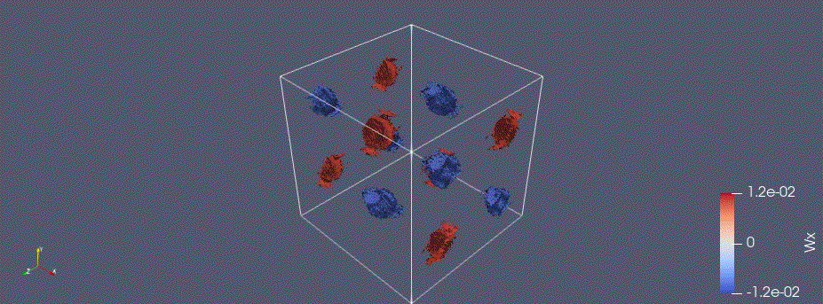
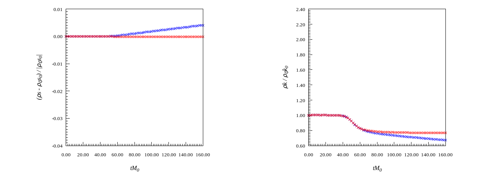
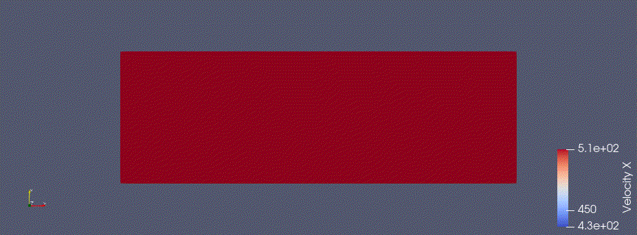
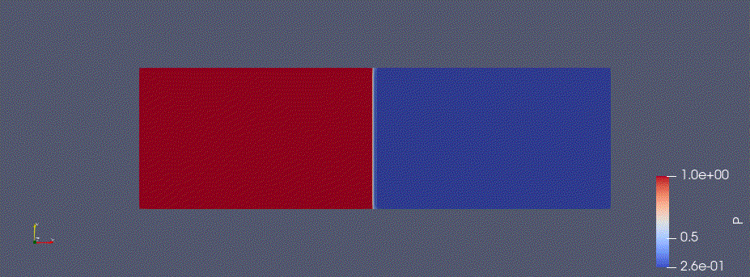
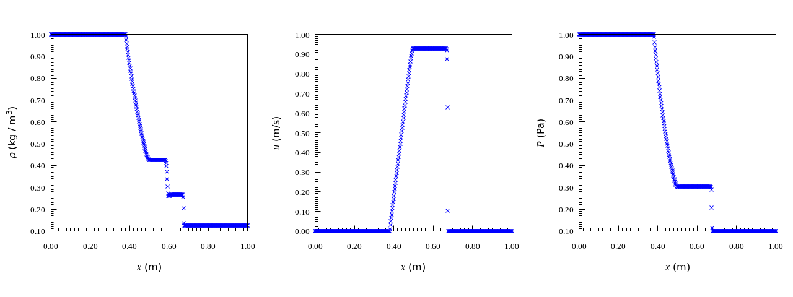
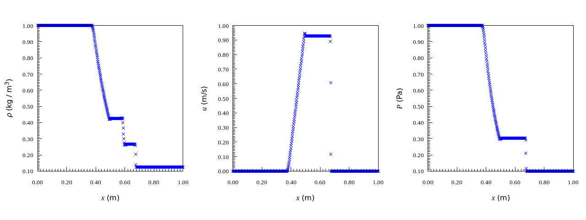

<!DOCTYPE html>
<html lang="en">
<head>
<meta charset="UTF-8">
</head>

<body>
<h1>
Compressible solver
</h1>

2D and 3D solvers are accelerated by GPU

<h2>
KEEP scheme
</h2>

Taylor-Green vortex 

<h2>
SLAU scheme
</h2>

Oblique shock

2 dimensional shock tube

1 dimensional shock tube

<h2>
KEEP + Roe hybrid scheme
</h2>

1 dimensional shock tube

<h2>
Dependency
</h2>
<ul>
<li>nvfortran</li>
<li>ParaView</li>
<li>gnuplot</li>
</ul>

<h2>
Reference
</h2>
<ul>
<li><a href="https://www.sciencedirect.com/science/article/abs/pii/S0021999118305916">
Yuichi Kuya, Kosuke Totani, Soshi Kawai, Kinetic energy and entropy preserving schemes for compressible flows by split convective forms, Journal of Computational Physics, 2018</a>
</li>
<li><a href="https://www.sciencedirect.com/science/article/abs/pii/S0021999121003776">
Yuichi Kuya, Soshi Kawai, High-order accurate kinetic-enrgy and entropy preserving (KEEP) schemes on curvilinear grids, Journal of Computational Physics, 2021</a>
</li>
<li><a href="https://www.sciencedirect.com/science/article/pii/S187775031630299X?via%3Dihub">
Christian T. Jacobs, Satya P. Jammy, Neil D. Sandham, OpenSBLI: A framework for the automated derivation and parallel execution of finite difference solvers on a range of computer architectures, 2017</a>
</li>
<li><a href="https://arc.aiaa.org/doi/abs/10.2514/6.2009-3797">
Yves Allaneau, Antony Jameson, Direct Numerical Simulations of a Two-Dimensional Viscous Flow in a Shocktube Using Kinetic Energy Preserving Scheme, 2012</a>
</li>
<li><a href="https://arc.aiaa.org/doi/10.2514/6.2023-0429">Yoshiharu Tamaki, Soshi Kawai, Wall-modeled LES of transonic buffet over NASA-CRM using Cartesian-grid-based flow solver FFVHC-ACE, 2023</a>
</li>
<li><a href="https://docs.nvidia.com/hpc-sdk/pgi-compilers/2017/pgi17cudaforug.pdf">
CUDA FORTRAN PROGRAMMING GUIDE AND REFERENCE, 2017</a>
</li>
</ul>
</body>
</html>
