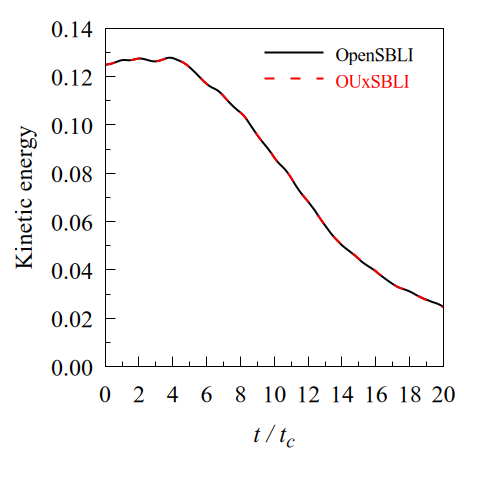
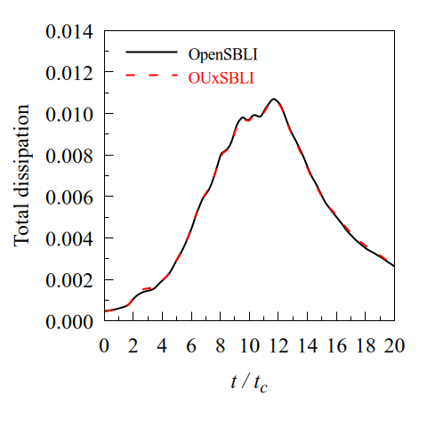
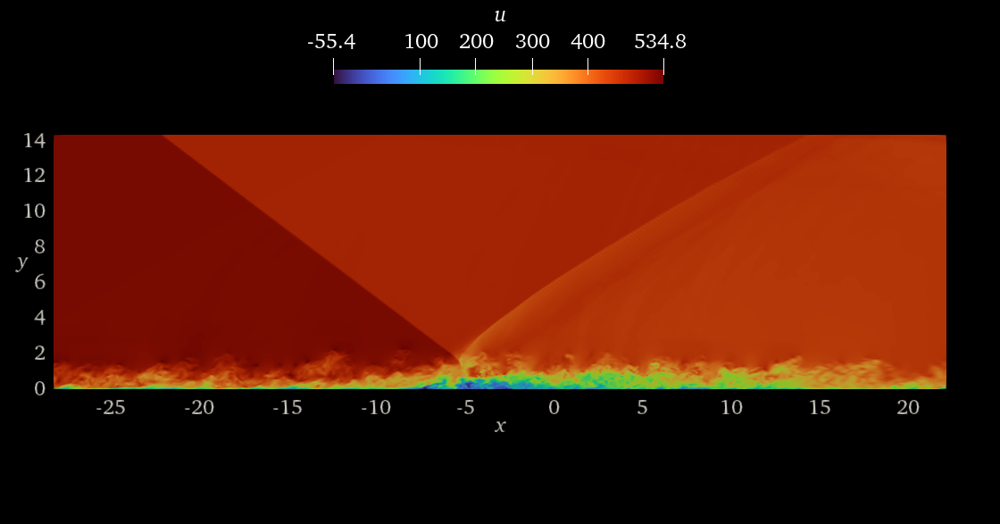
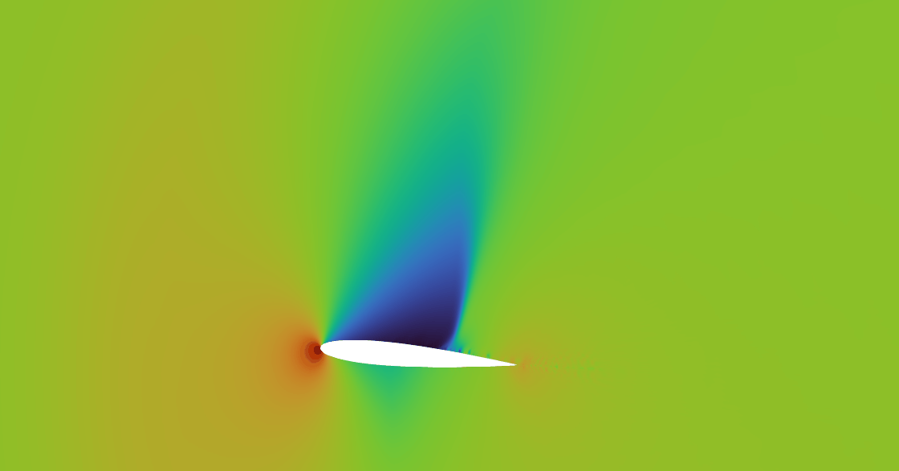

    

OUxSBLI is a GPU-accelerated CFD code written in CUDA Fortran. It employs explicit high-order finite-difference schemes on a rectilinear and a curvilinear grid.

## Dependency
* HPC SDK (version 24.* and 25.* are better)
* ParaView (for visualization output files are XML VTK format)

## Usage
1. Go to a working directory (supersonic viscous Taylor-Green vortex)
~~~bash
$ cd ./3D_solver/NSTGV
~~~

2. Edit mod_globals.f90
  * Choose equation type "id_visc" (Euler or NS)
  * Choose scheme "id_scheme", "id_accuracy", "id_tvd", and "id_slau"
  * Choose grid size "nx", "ny", and "nz"
  * Optimize block-size
  * Choose time integration method
3. Edit set.f90
  * Set grid
  * Set initial conditions
  * Set boundary conditions

4. Compile
~~~bash
$ make
~~~

5. Execute
~~~bash
$ bash ./calc.sh
~~~

6. Optimization
* In some directories, you can get nsys and ncu iformation by running profile.sh

## Discretization
### Spatial (Convection terms)
* Kinetic energy and entropy preserving (KEEP) scheme
* Simple low-dissipation AUSM (SLAU) scheme
* Roe scheme
* KEEP / SLAU hybrid scheme
### Spatial (Viscous terms)
* ME4-Base
* Gaitonde and Visbal's 2nd-order scheme
### Spatial SGS
* Selective mixed scale model (Under development)
### Temporal
* 3-3 TVD Runge-Kutta
* 4-4 Runge-Kutta

## Validations and visualizations

### Supersonic Taylor-Green vortex
The results are consistent with Lusher's results.
* Numerical setup

|$Re$   |$1600$ |
| :---: | :---: |
|$Ma$   |$1.25$ |
|$N_x \times N_y \times N_z$|$512\times512\times512$|

~~~bash
@article{lusher2021assessment,
  title={Assessment of low-dissipative shock-capturing schemes for the compressible Taylor--Green vortex},
  author={Lusher, David J and Sandham, Neil D},
  journal={AIAA Journal},
  volume={59},
  number={2},
  pages={533--545},
  year={2021},
  publisher={American Institute of Aeronautics and Astronautics}
}
~~~

    

    

### Shock Boundary Layer Interaction (SBLI)

    

### NACA0012

  

## Related Publication
This repository contains the implementation used in the following publication:

Jun Hatayama, Kento Tanaka, and Toshinori Kouchi. "Nonlinear causal relationship between separation bubbles and reflected shock wave in shock wave/turbulent boundary layer interaction based on information theory." Computers & Fluids (2026): 107016.

~~~bash
@article{hatayama2026nonlinear,
  title={Nonlinear causal relationship between separation bubbles and reflected shock wave in shock wave/turbulent boundary layer interaction based on information theory},
  author={Hatayama, Jun and Tanaka, Kento and Kouchi, Toshinori},
  journal={Computers \& Fluids},
  pages={107016},
  year={2026},
  publisher={Elsevier}
}
~~~

The repository was made publicly available after publication to improve reproducibility. However, this version may differ slightly from the version used in the paper.

## AI-Assisted Development
Development during 2024 and 2025 was primarily conducted by the project owner.  
Starting in 2026, the project expanded its contributor base and introduced AI-assisted "vibe coding" workflows using Claude Code.

To maintain transparency, we aim to clearly distinguish which parts of the codebase and development workflow involve AI-generated content or AI-assisted modifications. In addition, as part of our effort to share practical knowledge on AI-assisted development in the HPC community, we provide Claude Code plan files under `./docs/plans`.

## License
This project is under BSD 3-Clause License
