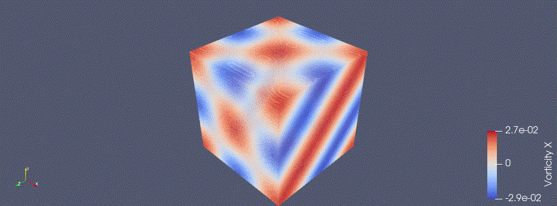

<!DOCTYPE html>
<html lang="en">
<head>
<meta charset="UTF-8">
</head>

<body>
<h1>
Compressible solver
</h1>

This solver accelerated by GPU can deal with compressible flows. KEEP scheme is available. (2024/3/2)

<h2>
KEEP scheme
</h2>

Taylor-Green vortex was calculated. 

<h2>
Dependency
</h2>
<ul>
<li>nvfortran 24.1-0</li>
</ul>

<h2>
Usage
</h2>
<ul>
<li> Edit input.d file grid, physical properties, and simulation time etc. </li>
<li> Edit mod_globals.f90 file to choose accuracy. 2nd-order accuracy and 4th-order accuracy are available. </li> 
<li> Edit mod_globals.f90 file to choose Euler solver or Navier-Stokes solver. Moreover, turbulent model can be used. </li>
<li> Edit calc_time_dev.f90 to choose appropriate gridDim and blockDim. The number of threads should be a multiple of 32 to make the most of GPU. </li>
<li><pre>$ make</pre></li>
</ul>

<h2>
Reference
</h2>
<ul>
<li><a href="https://www.sciencedirect.com/science/article/abs/pii/S0021999118305916">
Yuichi Kuya, Kosuke Totani, Soshi Kawai, Kinetic energy and entropy preserving schemes for compressible flows by split convective forms, Journal of Computational Physics, 2018</a>
</li>
<li><a href="https://www.sciencedirect.com/science/article/abs/pii/S0021999121003776">
Yuichi Kuya, Soshi Kawai, High-order accurate kinetic-enrgy and entropy preserving (KEEP) schemes on curvilinear grids, Journal of Computational Physics, 2021</a>
</li>
<li><a href="https://docs.nvidia.com/hpc-sdk/pgi-compilers/2017/pgi17cudaforug.pdf">
CUDA FORTRAN PROGRAMMING GUIDE AND REFERENCE, 2017</a>
</li>
</ul>
</body>
</html>
